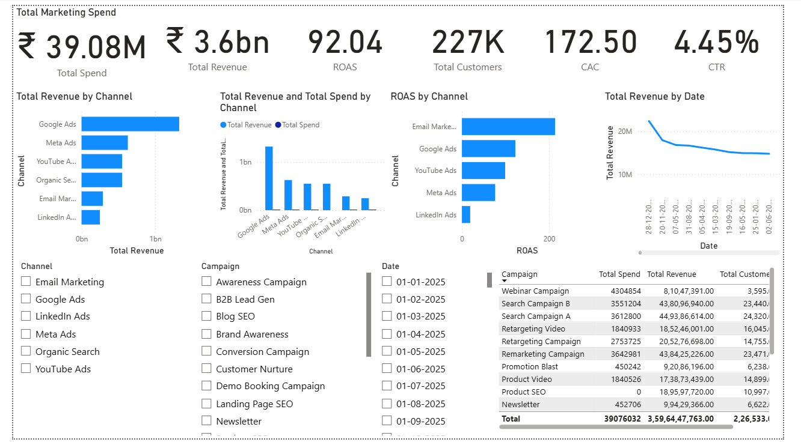
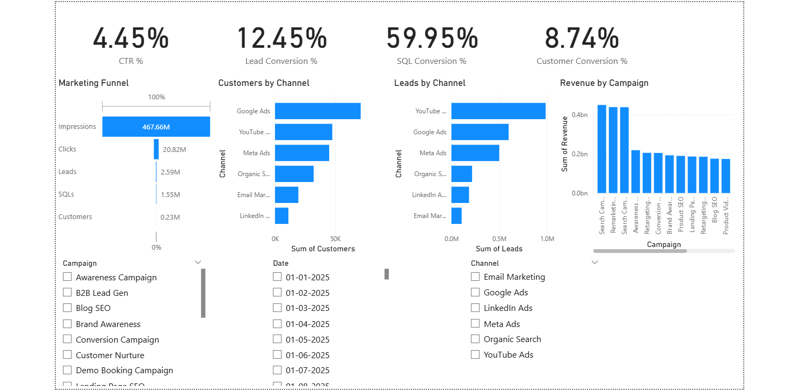

# Marketing Campaign Performance Dashboard

## Overview

Developed an interactive Power BI dashboard to analyze marketing campaign performance across 6 digital channels and 9 marketing campaigns.

The dashboard tracks key marketing KPIs including Revenue, Spend, ROAS, CAC, CTR, Lead Conversion Rate, SQL Conversion Rate, and Customer Conversion Rate to support data-driven decision making.

## Tools Used

* Power BI
* DAX
* Power Query
* Microsoft Excel

## Key Highlights

* Built 10+ DAX measures for marketing performance tracking.
* Analyzed campaign performance across 6 acquisition channels.
* Evaluated 226K+ customer conversions through funnel analysis.
* Designed interactive dashboards with slicers, KPI cards, trend analysis, and channel-level insights.

## Executive Dashboard

### Features

* Revenue vs Spend Analysis
* ROAS Tracking
* Customer Acquisition Cost Analysis
* Channel Performance Comparison
* Revenue Trend Analysis
* Campaign Performance Monitoring

## Marketing Funnel Analysis

### Funnel Stages

Impressions → Clicks → Leads → SQLs → Customers

### Metrics Tracked

* CTR
* Lead Conversion Rate
* SQL Conversion Rate
* Customer Conversion Rate

## Repository Contents

* marketing_analytics_Dashboard.pbix
* Executive-Dashboard.png
* funnel-analysis.png

